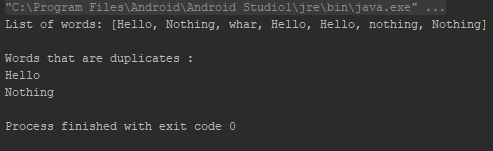
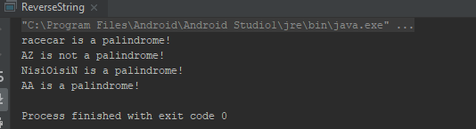
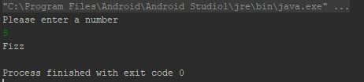
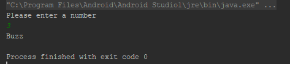
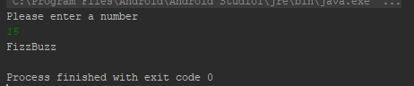
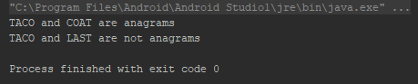
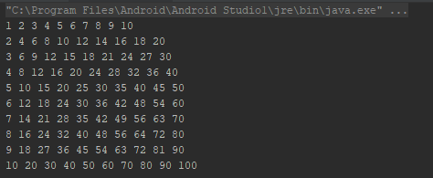

# WeekOneDayTwo
1. Create a function to print the duplicates in a list of strings
   public void findDuplicates(List<String> strings){};

2. Create function to check if the string is a palindrome without using string.reverse() method
   public boolean checkPalindrome(String word){};

3. Create a function that will print:
     "fizz" is the number is divisible by 3
     "buzz" is the number is divisible by 5
     "fizzbuzz" is the number is divisible by both

4.  Create a function to check if the two strings are Anagrams:    Eg COAT and TACO would be anagrams
   public boolean checkAnagrams(String word1, String word2){};

5. Print a multiplication table from 1 to 10 using  multidimensional array
   Output
   1 2 3 4 5 6 7 8 9 10
   2 4 6 8 10 12 14 16 18 20
    ...
 public void printTables(){};

DUE DATE June 5, 2019 at 1:59pm ET
